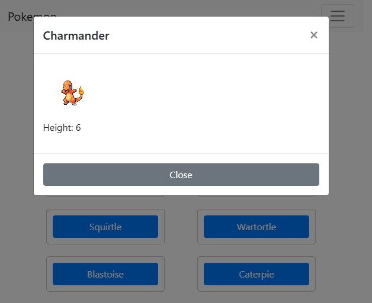

# Pokédex App

This repository contains the **Pokédex App**, a responsive web application that allows users to browse and learn about various Pokémon. The app fetches data from an external API and presents it in an intuitive and user-friendly interface.

---

## Table of Contents

1. [Project Overview](#project-overview)
2. [Features](#features)
3. [Technologies Used](#technologies-used)
4. [Setup and Installation](#setup-and-installation)
5. [Usage](#usage)
6. [API Reference](#api-reference)
7. [License](#license)
8. [Author](#author)

---

## Project Overview

The **Pokédex App** provides an interactive platform where users can:

- View a list of Pokémon.
- Search for specific Pokémon by name.
- Click on a Pokémon to view detailed information, including stats, type, and abilities.

This project was created to practice building dynamic web applications and working with external APIs.

---

## Features

- **Pokémon List**: Displays a list of Pokémon with images and names.
- **Search Functionality**: Allows users to search for Pokémon by name.
- **Detailed View**: Provides detailed information about a selected Pokémon, such as:
  - Type
  - Abilities
  - Stats (HP, Attack, Defense, etc.)
- **Responsive Design**: Optimized for mobile, tablet, and desktop devices.

---

## Technologies Used

- **HTML5** - Structure of the app.
- **CSS3** - Styling and layout design.
- **JavaScript** - Dynamic functionality and data fetching.
- **Bootstrap** - Responsive design framework.
- **Fetch API** - For making HTTP requests to retrieve Pokémon data.

---

## Setup and Installation

To run the Pokédex App locally, follow these steps:

1. **Clone the repository**:
   ```bash
   git clone git@github.com:Mahir33/CF-Pokedex.git
   cd CF-Pokedex
   ```
2. **Open the project**:

   - Simply open the `index.html` file in a browser.

3. **Optional (Local Development Server)**:
   If you are using a development server like VS Code Live Server, run it to see real-time changes.

---

## Usage

- Open the app in a browser.
- Browse through the list of Pokémon or search for a specific Pokémon using the search bar.
- Click on a Pokémon to view detailed information.

---

## API Reference

This project uses the **PokéAPI** to retrieve data about Pokémon:

- [PokéAPI Documentation](https://pokeapi.co/)

---

## License

This project is licensed under the **MIT License**.

---

## Author

**Mahir33**  
[GitHub Profile](https://github.com/Mahir33)

## Visual Overview



